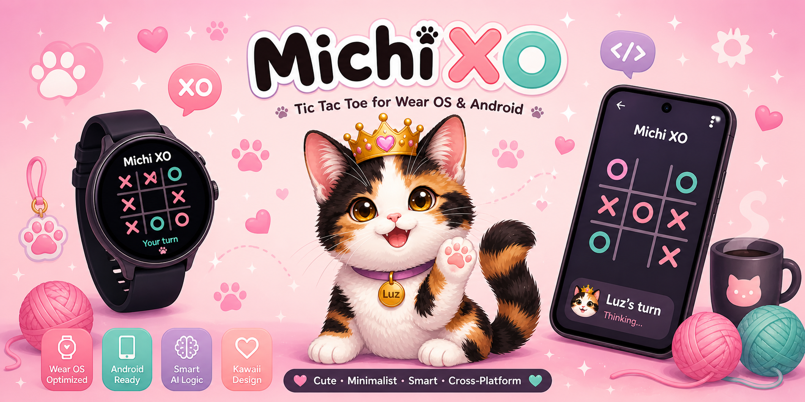

# 🐱 MichiXO – Tic Tac Toe for Wear OS & Mobile

  

A kawaii-inspired Tic Tac Toe game where you challenge **Luz**, a playful AI cat, in a minimalist and optimized experience for both **smartwatches and mobile devices**.

---

##  Features

- Single player mode against AI (Luz)
- Smart move selection (basic AI logic)
- Clean and minimalist UI (kawaii style)
- Tablet & mobile optimized layouts
- Designed for Wear OS small screens
- Lightweight and smooth performance

---

## Tech Stack

- Kotlin
- Jetpack Compose
- Wear OS
- Android Studio
- Modular architecture (`michixo-core` + mobile + wear)
  
---

## Architecture

The project follows a modular approach:

- michixo-core → game logic (rules, AI, engine)
- michixo-mobile → mobile UI (Jetpack Compose)
- app → smartwatch UI

This allows sharing logic across platforms while keeping UI independent.

---

## Vision

MichiXO is more than a Tic Tac Toe game — it's a foundation for building cute, optimized, and intelligent cross-device experiences, combining mobile development and AI concepts.
